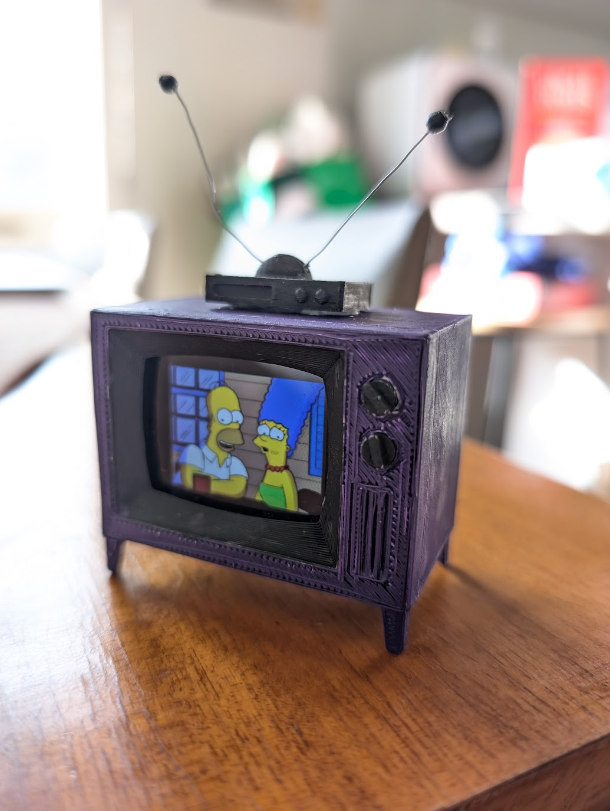

# Tiny Simpsons smartwatch TV

A tiny little TV that plays episodes of The Simpsons. This project is based on
the excellent [original](https://withrow.io/simpsons-tv-build-guide) by
Brandon Withrow. The main difference is that instead of a Raspberry Pi Zero, the
guts of this TV comprise an [LG G Watch](https://en.wikipedia.org/wiki/LG_G_Watch) smartwatch. This watch was
released in 2014 and it runs Android 6.

Video playback is achieved with a custom watchface app. When the screen is
tapped, the app plays a single randomly chosen video to the end and then goes to
sleep.

As you might imagine, a smartwatch from 2014 doesn't have a whole lot of CPU
headroom for video playback, so we need to take some steps to get a reasonable
framerate.

First, all videos are transcoded to vp9 at a 280x210 resolution and rotated to
match the screen size and orientation (see `tools/encode_two_pass.sh`). We then
use the [ExoPlayer](https://github.com/androidx/media) library to decode video
directly to the watchface surface to make use of hardware acceleration.

While the device itself doesn't have a speaker, the watch can stream audio to a
nearby Bluetooth speaker.

Main parts of the repository:

 - `app/`: Watchface source code (Kotlin)
 - `tools/`: Scripts for encoding video files. Use `adb push video.webm /sdcard/Movies` to place the resulting video to the watch.
 - `simptv.blend`: 3D model, mainly just scaled down from the original by
 [buba447](https://www.thingiverse.com/buba447) (Licensed under the Creative
 Commons - Attribution license).
